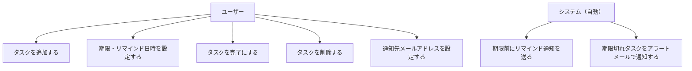
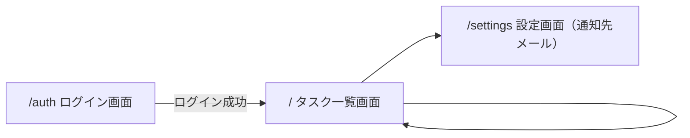

# 機能設計書

## 1. ユースケース図

---

## 2. 画面遷移図

---

## 3. 画面構成

### /auth　ログイン・サインアップ画面
- メールアドレスとパスワードで新規登録・ログイン
- 未ログインのユーザーがどのページにアクセスしても自動でここにリダイレクト

### /　タスク一覧画面（要ログイン）
- タスクの追加（テキスト入力 + 期限日時入力 + 追加ボタン）
- タスクの完了切り替え（チェックボックス）
- タスクの削除（削除ボタン）
- 期限切れタスクを赤く表示して視覚的に警告
- 自分のタスクのみ表示

### /settings　設定画面（要ログイン）
- 漏れ通知を送るメールアドレスの登録・変更

## 4. データ設計

### tasks テーブル

| カラム名 | 型 | 内容 |
|---|---|---|
| id | UUID | タスクを一意に識別する番号（自動生成） |
| user_id | UUID | 誰のタスクか（ログインユーザーのID） |
| title | text | タスクの内容 |
| completed | boolean | 完了状態（デフォルト：false） |
| due_date | timestamp | 期限日時 |
| remind_at | timestamp | リマインドを送る日時 |
| created_at | timestamp | 作成日時（自動生成） |

### profiles テーブル（通知先メール保存用）

| カラム名 | 型 | 内容 |
|---|---|---|
| id | UUID | ユーザーID（Supabase AuthのIDと紐づく） |
| alert_email | text | 期限切れ通知を送るメールアドレス |

## 5. API設計（Next.js API Routes）

| メソッド | パス | 処理 |
|---|---|---|
| GET | /api/tasks | タスク一覧取得 |
| POST | /api/tasks | タスク追加（due_date・remind_at含む） |
| PATCH | /api/tasks/[id] | タスク更新（完了切り替え） |
| DELETE | /api/tasks/[id] | タスク削除 |
| GET | /api/settings | 通知先メール取得 |
| POST | /api/settings | 通知先メール保存 |
| POST | /api/notify | 期限切れタスクをメール送信（定期実行用） |
